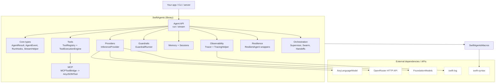
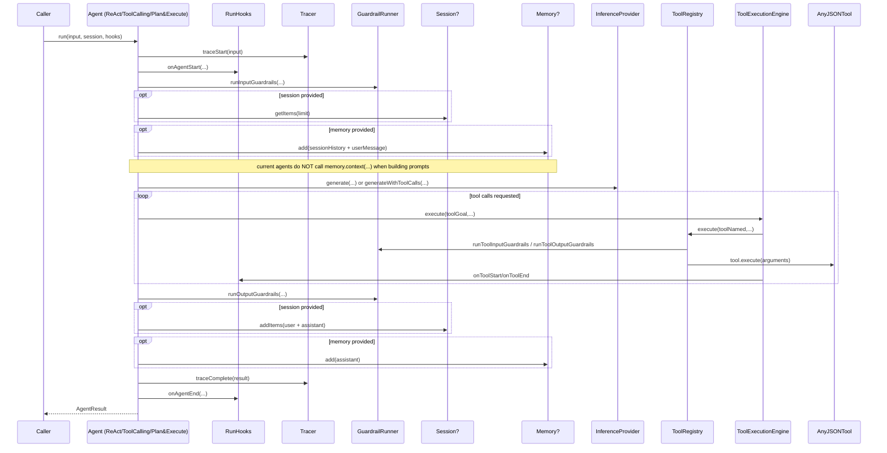

# SwiftAgents Architecture Review (Agents + Infrastructure)

**Date:** 2026-01-18  
**Scope:** `Sources/SwiftAgents` (library), `Sources/SwiftAgentsMacros` (macros), `Sources/SwiftAgentsDemo` (demo)  
**Focus:** Agent execution, tool system, memory/sessions, guardrails, orchestration, observability, resilience, providers, MCP

> Security note: This document intentionally does not reproduce any API keys. The repo currently contains
> hard-coded credentials in demo sources; rotate and remove them before sharing logs/screenshots or
> publishing branches.

## Executive Summary

SwiftAgents is a strong, protocol-oriented Swift agent framework with a good separation of concerns:
agents, tools, providers, memory, guardrails, orchestration, observability, and resilience are all
present as composable subsystems.

That said, several “headline” capabilities are currently **partially unwired** at runtime (especially
memory and guardrail observability), and a few wrappers drop important surface area (handoffs,
guardrails, tracer) which can quietly break orchestration/inspection. The demo target also contains
hard-coded API credentials, which is a security and reputational risk for a public repo.

### Highest-impact priorities (recommended)

1. **P0 Security:** Remove hard-coded API keys from demos/playgrounds and rotate the compromised keys.
2. **P0 Product correctness:** Wire `Memory.context(for:tokenLimit:)` into prompt construction (or remove
   the memory parameter until it’s actually used).
3. **P0 Observability + safety:** Emit `RunHooks.onGuardrailTriggered` from agent/tool guardrail execution,
   and propagate guardrail failures cleanly to `AgentEvent`.
4. **P1 API correctness:** Ensure wrappers (`AnyAgent`, `ResilientAgent`) forward `handoffs`,
   `inputGuardrails`, `outputGuardrails`, and `tracer`.
5. **P1 Provider completeness:** Implement tool calling in `LanguageModelSession.generateWithToolCalls`
   and gate `FoundationModels` imports for non-Apple builds.

## Repository Map

### SwiftPM Targets

- `SwiftAgents` (library): core framework
- `SwiftAgentsMacros` (macro plugin): reduces boilerplate for tools/agents/builders/prompts
- `SwiftAgentsDemo` (executable): example usage (currently contains hard-coded API credentials)

### Top-level layout (high signal)

```
.
├─ Package.swift
├─ Sources/
│  ├─ SwiftAgents/                 # main library
│  ├─ SwiftAgentsMacros/           # macro implementations
│  └─ SwiftAgentsDemo/             # demo executable + playground
├─ Tests/                          # unit tests (SwiftAgents + macros)
├─ docs/                           # user-facing docs (some API drift)
├─ scripts/                        # dev utilities (coverage)
└─ SwiftSwarm-main/                # vendored package (NOT wired into SwiftAgents targets)
```

### Library module structure (`Sources/SwiftAgents/`)

```
Sources/SwiftAgents/
├─ Core/                           # Agent protocol, events, hooks, result types, streaming helpers
├─ Agents/                         # ReAct, ToolCalling, PlanAndExecute + DSL builder
├─ Tools/                          # AnyJSONTool + typed Tool, schema, registry, execution, built-ins
├─ Memory/                         # Memory + sessions, summarizers, embeddings, persistence backends
├─ Guardrails/                     # Input/output/tool guardrails + runner
├─ Providers/                      # Inference providers (OpenRouter, MultiProvider, FoundationModels)
├─ Orchestration/                  # Supervisor, Swarm, handoffs, router, pipeline/parallel operators
├─ Observability/                  # Tracers, spans/events, helper, metrics (partial integration)
├─ Resilience/                     # Retry/circuit breaker/fallback/timeout (rate limiter not wired)
├─ MCP/                            # Model Context Protocol client/server + tool bridge
├─ Macros/                         # public macro declarations
└─ Integration/                    # placeholder (Phase 7)
```

## Mental Map (How the Pieces Connect)

### Component graph (subsystem dependencies)



### Key observation: “Memory” is currently write-mostly

All primary agents accept `memory: (any Memory)?` and write messages to it, but do not call
`memory.context(for:tokenLimit:)` when constructing prompts. Practically, this makes `VectorMemory`,
`SummaryMemory`, etc. invisible to model context unless the app manually retrieves context and injects
it into `input` or agent `instructions`.

This mismatch matters because it affects:

- The effectiveness of “memory” features (RAG/summarization)
- Performance (memory can grow unbounded if session messages are repeatedly re-added)
- Documentation accuracy (docs imply memory influences prompts)

## Runtime Flows (Run + Stream)

### `run(...)` (common high-level path)



### `stream(...)` (how intermediate events are produced)

Most agents implement `stream(...)` using:

- `StreamHelper.makeTrackedStream(...)` for bounded buffering + cancellation
- `EventStreamHooks` to convert `RunHooks` callbacks into `AgentEvent`s
- `CompositeRunHooks` to combine user hooks + stream hooks

Notable inconsistencies:

- `ReActAgent.stream` and `ToolCallingAgent.stream` use `EventStreamHooks`, so tool/iteration events can
  stream through.
- `PlanAndExecuteAgent.stream` currently just calls `run` and yields only started/completed/failed (no
  intermediate events).
- `ResilientAgent.stream` similarly yields started/completed/failed and does not forward the base agent’s
  richer stream.

## Subsystem Review (What Exists + What’s Wired)

### 1) Core Runtime (`Sources/SwiftAgents/Core/`)

Key building blocks:

- `Agent` protocol (`Sources/SwiftAgents/Core/Agent.swift`)
- `AgentConfiguration` (`Sources/SwiftAgents/Core/AgentConfiguration.swift`)
- `AgentResult` / `AgentResponse` (`Sources/SwiftAgents/Core/AgentResult.swift`,
  `Sources/SwiftAgents/Core/AgentResponse.swift`)
- `RunHooks` + `EventStreamHooks` (`Sources/SwiftAgents/Core/RunHooks.swift`,
  `Sources/SwiftAgents/Core/EventStreamHooks.swift`)
- `AgentEvent` streaming model (`Sources/SwiftAgents/Core/AgentEvent.swift`)
- `StreamHelper` (`Sources/SwiftAgents/Core/StreamHelper.swift`)
- `SendableValue` dynamic JSON container (`Sources/SwiftAgents/Core/SendableValue.swift`)
- Response continuation helpers: `ResponseTracker` + `AgentConfiguration.previousResponseId`
  (`Sources/SwiftAgents/Core/ResponseTracker.swift`,
  `Sources/SwiftAgents/Core/AgentConfiguration.swift`)

Main gaps:

- **Continuation is unwired:** `previousResponseId` and `ResponseTracker` don’t influence prompt/provider
  requests; `runWithResponse(...)` generates a fresh UUID every time.
- **Guardrail hook is unwired:** `RunHooks.onGuardrailTriggered` exists, but agents/tools don’t call it.

### 2) Agents (`Sources/SwiftAgents/Agents/`)

#### ReActAgent

- Files: `Sources/SwiftAgents/Agents/ReActAgent.swift`,
  `Sources/SwiftAgents/Agents/ReActAgent+ResponseParsing.swift`
- Strength: works even when providers don’t support native tool calling (text-based fallback).
- Gap: writes to memory but doesn’t read memory context; also re-adds `sessionHistory` into memory every
  run (duplication risk).

#### ToolCallingAgent

- File: `Sources/SwiftAgents/Agents/ToolCallingAgent.swift`
- Strength: native tool-calling loop via `InferenceProvider.generateWithToolCalls(...)`.
- Gaps:
  - Tool calls are executed sequentially even when multiple tool calls are returned (parallel executor
    exists but isn’t used).
  - Same memory “write-only” + duplication behavior as ReActAgent.

#### PlanAndExecuteAgent

- Files: `Sources/SwiftAgents/Agents/PlanAndExecuteAgent.swift` and extensions:
  - `Sources/SwiftAgents/Agents/PlanAndExecuteAgent+Planning.swift`
  - `Sources/SwiftAgents/Agents/PlanAndExecuteAgent+Execution.swift`
  - `Sources/SwiftAgents/Agents/PlanAndExecuteAgent+Replanning.swift`
- Strength: structured plan JSON parsing, step dependencies, replanning and synthesis.
- Gaps:
  - `stream(...)` currently does not stream intermediate events (unlike ReAct/ToolCalling).
  - No memory context retrieval; uses session history string only.

#### Agent DSL / builder

- File: `Sources/SwiftAgents/Agents/AgentBuilder.swift`
- Strength: declarative construction of agents with tools, memory, providers, guardrails, handoffs.

### 3) Tools (`Sources/SwiftAgents/Tools/`)

Key abstractions:

- Dynamic boundary: `AnyJSONTool` (`Sources/SwiftAgents/Tools/Tool.swift`)
- Developer-facing typed tools: `Tool` (`Sources/SwiftAgents/Tools/TypedToolProtocol.swift`)
- Bridging: `AnyJSONToolAdapter` (`Sources/SwiftAgents/Tools/ToolBridging.swift`)
- Registry: `ToolRegistry` (`Sources/SwiftAgents/Tools/Tool.swift`)
- Execution plumbing: `ToolExecutionEngine` (`Sources/SwiftAgents/Tools/ToolExecutionEngine.swift`)
- Parallel execution support (currently unused by agents): `ParallelToolExecutor`
  (`Sources/SwiftAgents/Tools/ParallelToolExecutor.swift`)

Built-in tools:

- `Sources/SwiftAgents/Tools/BuiltInTools.swift` (Calculator/DateTime/String, etc.)
- Note: `CalculatorTool` is gated behind `#if canImport(Darwin)` even though it uses a pure Swift
  `ArithmeticParser` internally; comments still reference `NSExpression` (drift).

Tool guardrails:

- Tool guardrails exist and are executed in `ToolRegistry.execute(...)`, but **guardrail results are not
  emitted through `RunHooks.onGuardrailTriggered`** (only `onError` is called on failure).

### 4) Memory + Sessions (`Sources/SwiftAgents/Memory/`)

What exists:

- Memory protocol + helpers: `Sources/SwiftAgents/Memory/AgentMemory.swift`
- Token estimation: `Sources/SwiftAgents/Memory/TokenEstimator.swift`
- Conversation stores: `ConversationMemory`, `SlidingWindowMemory`
- Long-horizon compression: `SummaryMemory`
- RAG/Retrieval: `VectorMemory` (requires `EmbeddingProvider`)
- Composition: `HybridMemory` (e.g., recent + vector)
- Embeddings: `EmbeddingProvider` + `MockEmbeddingProvider`
  (`Sources/SwiftAgents/Memory/EmbeddingProvider.swift`)
- Sessions: `Session` protocol + `InMemorySession`, `PersistentSession`
  (`Sources/SwiftAgents/Memory/Session.swift`, `Sources/SwiftAgents/Memory/InMemorySession.swift`)
- Persistence: `PersistentMemory`, `SwiftDataMemory`, backends under `Sources/SwiftAgents/Memory/Backends/`

Main gap (cross-cutting):

- **Agents don’t consume memory context** (`memory.context(...)` has no call sites in agent prompt
  builders), so the feature set is present but not realized in default execution.

### 5) Guardrails (`Sources/SwiftAgents/Guardrails/`)

What exists:

- `InputGuardrail` / `OutputGuardrail` protocols
  (`Sources/SwiftAgents/Guardrails/InputGuardrail.swift`,
   `Sources/SwiftAgents/Guardrails/OutputGuardrail.swift`)
- Closure-based guardrails + convenience factories (e.g., length checks)
- Tool guardrails (`Sources/SwiftAgents/Guardrails/ToolGuardrails.swift`)
- Guardrail execution orchestrator: `GuardrailRunner`
  (`Sources/SwiftAgents/Guardrails/GuardrailRunner.swift`)

Main wiring gaps:

- Agent-level guardrails run, but results are ignored and not surfaced through hooks/events/metadata.
- Tool-level guardrails run, but results are ignored and not surfaced through hooks/events/metadata.

### 6) Providers (`Sources/SwiftAgents/Providers/`)

- `OpenRouterProvider` (`Sources/SwiftAgents/Providers/OpenRouter/OpenRouterProvider.swift`):
  HTTP provider with retry + rate-limit parsing + tool calling support.
- `MultiProvider` (`Sources/SwiftAgents/Providers/MultiProvider.swift`): routes by model prefix/selection.
- `LanguageModelSession` adapter (`Sources/SwiftAgents/Providers/LanguageModelSession.swift`):
  - `generateWithToolCalls(...)` is currently TODO.
  - `import FoundationModels` is unconditional (breaks non-Apple builds).

### 7) Orchestration (`Sources/SwiftAgents/Orchestration/`)

What exists:

- `SupervisorAgent` routes to sub-agents via `RoutingStrategy`
  (`Sources/SwiftAgents/Orchestration/SupervisorAgent.swift`)
- `Swarm` supports multi-agent handoffs (`Sources/SwiftAgents/Orchestration/Swarm.swift`)
- Agent routing/operators: `AgentRouter`, `AgentOperators`, `SequentialChain`, `ParallelGroup`
- Handoff types + config + builders:
  `Sources/SwiftAgents/Orchestration/Handoff.swift`,
  `Sources/SwiftAgents/Orchestration/HandoffConfiguration.swift`,
  `Sources/SwiftAgents/Orchestration/HandoffBuilder.swift`

Placeholder:

- `Sources/SwiftAgents/Orchestration/Orchestrator.swift` is currently a phase placeholder.

### 8) Observability (`Sources/SwiftAgents/Observability/`)

What exists:

- Tracer protocols and implementations (`ConsoleTracer`, `OSLogTracer`, `SwiftLogTracer`)
- `TracingHelper` is used by agents to emit trace spans/events.
- Metrics types exist (e.g., `PerformanceMetrics`, `MetricsCollector`) but are not consistently wired into
  agent execution.

Placeholder:

- `Sources/SwiftAgents/Observability/Tracing.swift` is currently a phase placeholder.

### 9) Resilience (`Sources/SwiftAgents/Resilience/`)

What exists:

- `ResilientAgent` wrapper for retry/circuit breaker/fallback/timeout:
  `Sources/SwiftAgents/Resilience/ResilientAgent.swift`
- `RetryPolicy`, `CircuitBreaker`, `FallbackChain`, `RateLimiter`

Main gaps:

- `RateLimiter` exists but is not integrated into `ResilientAgent` fluent API.
- `ResilientAgent` does not forward base `tracer`, `handoffs`, or guardrails and does not forward the
  base agent’s richer `stream(...)` events.

### 10) MCP (`Sources/SwiftAgents/MCP/`)

What exists:

- MCP protocol types, server/client, HTTP server
- `MCPToolBridge` converts MCP tool definitions into `AnyJSONTool` so agents can call them:
  `Sources/SwiftAgents/MCP/MCPToolBridge.swift`

## Gaps, Bugs, and Areas for Improvement

### P0 — Security / repo safety

- **Hard-coded API keys in demo/playgrounds.**
  - Files to audit and sanitize:
    - `Sources/SwiftAgentsDemo/AgentTest.swift`
    - `Sources/SwiftAgentsDemo/SwiftAgentsPlayground.playground/Pages/Page2.xcplaygroundpage/Contents.swift`
    - `Sources/SwiftAgentsDemo/SwiftAgentsPlayground.playground/Pages/Page2 2.xcplaygroundpage`
    - `Sources/SwiftAgentsDemo/SwiftAgentsPlayground.playground/Pages/Page2 3.xcplaygroundpage`
  - Recommended remediation:
    - Rotate the compromised key(s) immediately.
    - Replace in-code keys with env var lookup (and provide `.env.example`).
    - Add secret scanning (pre-commit + CI) to prevent reintroduction.

### P0 — Product correctness / “feature wiring”

- **Memory is not used in prompt construction.**
  - Impact: `VectorMemory`/`SummaryMemory` don’t influence the model unless the app manually injects
    context.
  - Evidence: no agent calls `memory.context(for:tokenLimit:)`.

- **Guardrail hook/events are not emitted.**
  - `RunHooks.onGuardrailTriggered` and `EventStreamHooks.onGuardrailTriggered` exist, but guardrail
    execution paths do not call them.
  - `EventStreamHooks.onError` converts non-`AgentError` errors into `.internalError`, which hides
    `GuardrailError` specificity in the stream.

### P1 — API correctness / wrapper behavior

- **Type erasure and wrappers drop important properties.**
  - `AnyAgent` forwards tools/instructions/config/memory/provider/tracer, but falls back to default
    `inputGuardrails`, `outputGuardrails`, and `handoffs` (losing base agent behavior/introspection).
  - `ResilientAgent` drops base `tracer`, guardrails, handoffs, and does not forward rich streaming.

- **Cancellation is cooperative but cannot cancel in-flight provider/tool work.**
  - Agents set flags (or state) but do not cancel the running task for LLM calls; `currentTask` exists but
    is not assigned in core agents.

### P1 — Provider completeness / portability

- **`LanguageModelSession.generateWithToolCalls(...)` is TODO.**
  - ToolCalling flows relying on Foundation Models cannot function for native tool calling.

- **Unconditional `import FoundationModels` prevents non-Apple builds.**
  - File: `Sources/SwiftAgents/Providers/LanguageModelSession.swift`
  - Most other FoundationModels usages are gated behind `#if canImport(FoundationModels)` already.

- **`CalculatorTool` platform gating is inconsistent with implementation.**
  - File: `Sources/SwiftAgents/Tools/BuiltInTools.swift`
  - Can likely be made cross-platform by removing the Darwin gate if dependencies allow.

### P2 — “Dead / waiting to be connected” surfaces

- `ParallelToolExecutor` exists but is not used by agents (tool calls are executed sequentially).
- `ResponseTracker` / `previousResponseId` exist but are not integrated in agents/providers.
- Placeholder phase files compiled into the library:
  - `Sources/SwiftAgents/Integration/Integration.swift`
  - `Sources/SwiftAgents/Observability/Tracing.swift`
  - `Sources/SwiftAgents/Orchestration/Orchestrator.swift`
- Vendored package `SwiftSwarm-main/` exists but is not referenced by `Package.swift` targets.

### P2 — Documentation drift / DX hazards

- `docs/API_REFERENCE.md` references `SendableValue.object(...)`, but the enum case is
  `SendableValue.dictionary(...)` (compile-time mismatch).
- `Sources/SwiftAgents/SwiftAgents.swift` contains a Quick Start that doesn’t match current public APIs
  (`execute`, `FoundationModel.default`, and “minimumPlatformVersion 26.0” are inconsistent with the
  package manifest).

### P3 — Repo hygiene

- `.DS_Store` files are committed across `Sources/`, `Tests/`, and `docs/`.
- Consider tightening `.gitignore` and running a cleanup pass.

## Recommended Developer Experience Improvements (Concrete)

1. **Create a “Getting Started (No Secrets)” path**
   - Demo reads API key from env (`OPENROUTER_API_KEY`) and fails with a friendly message when missing.
   - Add `docs/quickstart.md` that works with copy/paste and no code edits.

2. **Add a “Which agent should I use?” decision doc**
   - ReAct vs ToolCalling vs PlanAndExecute, with a short tradeoff matrix.

3. **Make memory usage explicit**
   - Either wire memory context into prompt building or rename to `storage` to avoid misleading APIs.
   - Add a “Memory is write-only unless…” note until fixed.

4. **Unify streaming fidelity**
   - Ensure every agent and wrapper either forwards base streaming or clearly documents the limitation.

5. **Improve guardrail observability**
   - Emit guardrail events via hooks + `AgentEvent` so users can build UIs/telemetry around safety checks.

6. **Portability guardrails**
   - Gate `FoundationModels` imports and remove needless Darwin-only gates where possible.

## Candidate Backlog (Prioritized)

### P0

- Remove demo/playground API keys; rotate compromised keys.
- Wire memory retrieval into prompt building for all agent types (or clearly deprecate the parameter).
- Emit guardrail events through `RunHooks` and `AgentEvent` for both agent-level and tool-level guardrails.

### P1

- Fix wrapper forwarding (`AnyAgent`, `ResilientAgent`) for guardrails/handoffs/tracer + stream forwarding.
- Implement native tool-calling in `LanguageModelSession.generateWithToolCalls`.
- Improve cancellation by cancelling in-flight provider work (task tracking + cancellation propagation).

### P2

- Integrate `ParallelToolExecutor` into ToolCalling/ReAct native tool-call execution when multiple tool
  calls arrive.
- Resolve documentation drift (SendableValue API, Quick Start, hook signatures).
- Decide what to do with placeholder phase files (remove from target, implement, or move to docs).

### P3

- Remove committed `.DS_Store` files + tighten `.gitignore`.
- Decide whether `SwiftSwarm-main/` stays as a vendor snapshot or is removed/submoduled.

## Appendix: Key Entry Points (File Index)

### Agents

- `Sources/SwiftAgents/Agents/ReActAgent.swift`
- `Sources/SwiftAgents/Agents/ToolCallingAgent.swift`
- `Sources/SwiftAgents/Agents/PlanAndExecuteAgent.swift`
- `Sources/SwiftAgents/Agents/AgentBuilder.swift`

### Tooling

- `Sources/SwiftAgents/Tools/Tool.swift`
- `Sources/SwiftAgents/Tools/TypedToolProtocol.swift`
- `Sources/SwiftAgents/Tools/ToolBridging.swift`
- `Sources/SwiftAgents/Tools/ToolExecutionEngine.swift`
- `Sources/SwiftAgents/Tools/ParallelToolExecutor.swift`

### Providers

- `Sources/SwiftAgents/Providers/OpenRouter/OpenRouterProvider.swift`
- `Sources/SwiftAgents/Providers/MultiProvider.swift`
- `Sources/SwiftAgents/Providers/LanguageModelSession.swift`

### Memory + Sessions

- `Sources/SwiftAgents/Memory/AgentMemory.swift`
- `Sources/SwiftAgents/Memory/SummaryMemory.swift`
- `Sources/SwiftAgents/Memory/VectorMemory.swift`
- `Sources/SwiftAgents/Memory/Session.swift`

### Guardrails

- `Sources/SwiftAgents/Guardrails/GuardrailRunner.swift`
- `Sources/SwiftAgents/Guardrails/InputGuardrail.swift`
- `Sources/SwiftAgents/Guardrails/ToolGuardrails.swift`

### Orchestration

- `Sources/SwiftAgents/Orchestration/SupervisorAgent.swift`
- `Sources/SwiftAgents/Orchestration/Swarm.swift`
- `Sources/SwiftAgents/Orchestration/Handoff.swift`

### Observability + Resilience

- `Sources/SwiftAgents/Observability/AgentTracer.swift`
- `Sources/SwiftAgents/Observability/TracingHelper.swift`
- `Sources/SwiftAgents/Resilience/ResilientAgent.swift`

### MCP

- `Sources/SwiftAgents/MCP/MCPToolBridge.swift`

